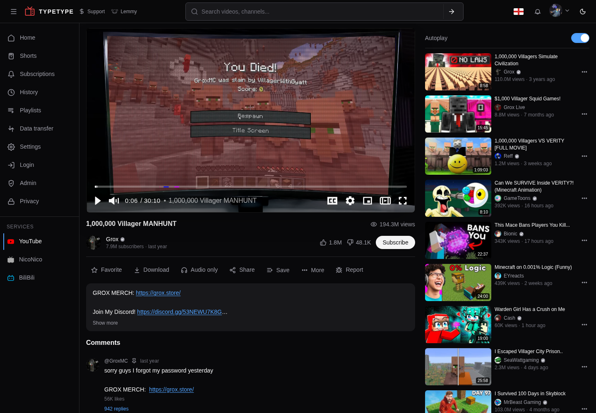
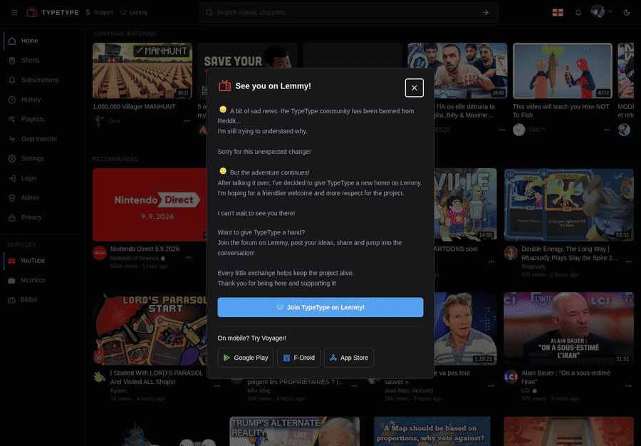
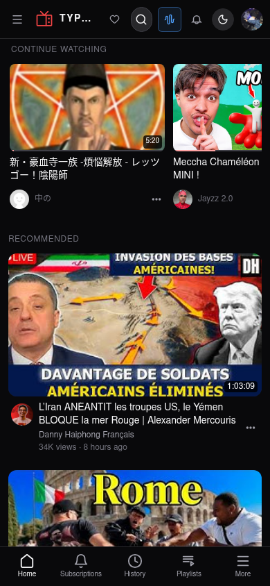
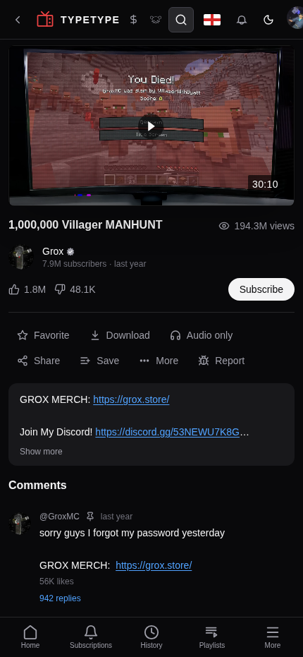

<p align="center">
  
</p>

# TypeType

TypeType is a self-hosted video platform for YouTube, NicoNico, and BiliBili.
Run one private instance, then use it from the responsive web app or the native
Android client. Accounts, subscriptions, history, playlists, favorites, watch
progress, and settings stay on the instance you control.

<p align="center">
  <a href="https://typetype.video/fdroid/"></a>
  <a href="https://github.com/TypeType-Video/TypeType-Android/releases/latest"></a>
</p>

## Install

Docker Engine and Docker Compose v2 are required for the self-hosted stack.

```sh
curl -fsSL https://raw.githubusercontent.com/TypeType-Video/TypeType/main/scripts/install-stack.sh | bash
```

## Web app

The web app runs in a modern browser on desktop and mobile. It provides
multi-service discovery, personal libraries, downloads, administration, and
SABR playback without installing a client.

<p align="center">
  
</p>

### Search across three services

<p align="center">
  
</p>

### Mobile web

| Home | Playback | Audio only |
| --- | --- | --- |
|  |  |  |

## Native Android app

[TypeType Android](https://github.com/TypeType-Video/TypeType-Android) is the
native client for Android phones and tablets. It connects directly to your
TypeType instance and includes synchronized accounts, subscriptions, history,
playlists, downloads, background audio, Picture in Picture, audio-only playback,
captions, SponsorBlock, comments, and native playback controls.

| Home | Native player | Settings |
| --- | --- | --- |
|  |  |  |

TypeType Android supports Android 6.0 and newer without requiring Google Play
Services. Read the
[Android installation guide](https://github.com/TypeType-Video/TypeType-Android#install)
for F-Droid and signed APK instructions.

## Self-host TypeType

This central repository contains the Docker Compose stack, installer, update
and rollback tools, release coordination, and project issue tracker. The web
and Android clients both connect to the same TypeType instance.

The installer creates `~/typetype-stack`, generates installation-specific secrets, and asks before starting the stack.

- [Quick start](https://typetype-video.github.io/Docs-TypeType/self-hosting/quick-start)
- [Manual Docker Compose setup](https://typetype-video.github.io/Docs-TypeType/self-hosting/docker-compose#manual-setup)
- [Configuration](https://typetype-video.github.io/Docs-TypeType/self-hosting/configuration)

### Maintain your instance

- [User guide](https://typetype-video.github.io/Docs-TypeType/guide/)
- [Update guide](https://typetype-video.github.io/Docs-TypeType/self-hosting/maintenance)
- [Rollback guide](https://typetype-video.github.io/Docs-TypeType/self-hosting/rollback)
- [Release notes](https://typetype.video/releases)
- [Report a bug or request a feature](https://github.com/TypeType-Video/TypeType/issues)

## What TypeType includes

- Responsive web and native Android clients for YouTube, NicoNico, and BiliBili
- Accounts, subscriptions, history, playlists, favorites, and watch progress
- MSE and SABR playback with quality, audio-track, subtitle, and recovery controls
- Video and audio downloads with local or S3-compatible storage
- SponsorBlock, DeArrow, content blocking, imports, OIDC, and instance administration
- No TypeType telemetry; the instance operator controls the deployment and its data

## For developers

Each component has its own repository, tests, release cycle, and license. Pull requests belong in the repository that owns the changed code. Bug reports and feature requests stay in the central issue tracker.

| Repository | Responsibility | License |
| --- | --- | --- |
| [TypeType](https://github.com/TypeType-Video/TypeType) | Stack, installer, releases, coordination, and issues | MIT |
| [TypeType-Android](https://github.com/TypeType-Video/TypeType-Android) | Native Android client | GPL-3.0 |
| [TypeType-Frontend](https://github.com/TypeType-Video/TypeType-Frontend) | React web client | MIT |
| [TypeType-Server](https://github.com/TypeType-Video/TypeType-Server) | Kotlin API, extraction, and user data | GPL-3.0 |
| [TypeType-Player](https://github.com/TypeType-Video/TypeType-Player) | Browser MSE and SABR playback package | MIT |
| [TypeType-Token](https://github.com/TypeType-Video/TypeType-Token) | YouTube token, decoder, and session service | MIT |
| [TypeType-Downloader](https://github.com/TypeType-Video/TypeType-Downloader) | Download jobs, muxing, and artifacts | GPL-3.0-or-later |
| [Docs-TypeType](https://github.com/TypeType-Video/Docs-TypeType) | User and self-hosting documentation | MIT |

Development changes target each component's `dev` branch. `main` represents the stable release line.

Clone the central stack and all public components with:

```sh
git clone --recurse-submodules https://github.com/TypeType-Video/TypeType.git
```

Read [CONTRIBUTING.md](CONTRIBUTING.md) before opening a pull request.

## Privacy and disclaimer

TypeType is designed to provide a private, self-hosted way to use supported media services. The project does not add telemetry or collect usage data. Instance operators control their own accounts, logs, storage, and network configuration.

TypeType is not affiliated with, funded, authorized, endorsed by, or associated with YouTube, Google LLC, NicoNico, BiliBili, or their affiliates. Trademarks, service marks, trade names, and other intellectual property belong to their respective owners.

TypeType is open source software built for learning and research purposes.

## License

The orchestration files in this repository are licensed under the [MIT License](LICENSE). Each component keeps the license shown in the repository table.
